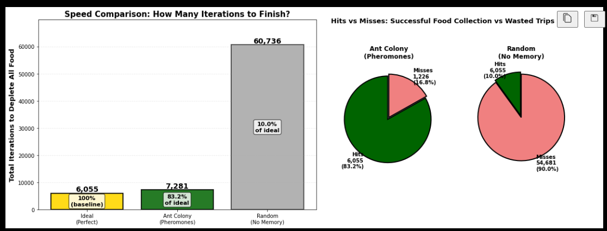
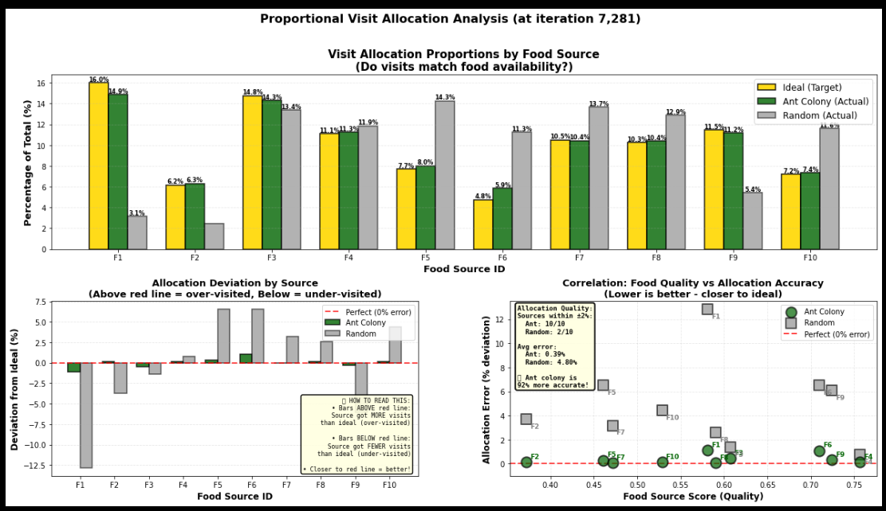

# Ant Colony Foraging Simulation

A Python simulation and notebook-based exploration of ant foraging behavior, stigmergy, and distributed reinforcement learning.

This project compares three strategies for collecting food from multiple sources:

- **Ant colony with pheromones**: ants reinforce successful paths over time.
- **Random exploration**: ants search without shared memory or trail following.
- **Ideal allocation**: a theoretical lower bound where every unit of food is collected with no wasted trips.

The repository includes both:

- a reusable Python class
- two Jupyter notebooks for guided exploration and visualization

## What the simulation demonstrates

The model creates a nest at `(0, 0)` and randomly places food sources inside a square search area. Each food source has the following attributes:

- distance from the nest
- quality (nutritional value)
- quantity
- ease of access

Food patches are then treated as circular patches for detection and visualization. These attributes are normalized and combined into a weighted score. During the ant colony run:

- scout ants periodically explore at random
- successful ants deposit pheromones on food trails based on food value
- follower ants bias toward the strongest pheromone trails
- pheromones evaporate over time so the colony can adapt when food sources are depleted

Detection is driven mainly by angular alignment from the nest. If multiple food patches fall within an ant's perceptual window, the simulation selects the closest one using straight-line Euclidean distance from the nest.

The project then compares the colony’s behavior against a pure random-search baseline and visualizes efficiency and allocation quality.

## Stigmergy vs. emergent complexity

The demo notebook also frames this simulation as a discussion about **stigmergy** versus stronger claims of **emergent complexity**.

- **Stigmergy** is clearly present: ants communicate indirectly by modifying the environment through pheromone trails.
- The colony shows **distributed reinforcement learning**: better paths get reinforced, weaker paths fade, and collective behavior shifts over time.
- The project does **not** treat this as evidence of genuinely new abilities emerging at the colony level. The ants together do not acquire a capacity that a single agent could not in principle reproduce with memory, repeated trips, and a notebook.

So the main claim of the project is not that the swarm creates a new form of intelligence, but that shared environmental memory can make a distributed system faster and more efficient without adding fundamentally new cognitive powers.

## Repository contents

- [ant_colony_simulation.py](ant_colony_simulation.py) — main simulation class and plotting utilities
- [Ant_Colony_Simulation_Demo.ipynb](Ant_Colony_Simulation_Demo.ipynb) — polished interactive demo using the class API
- [Ant_Colony_Simulation_Walkthrough.ipynb](Ant_Colony_Simulation_Walkthrough.ipynb) — step-by-step notebook showing the simulation logic cell by cell


## Main features

- Random environment generation for food source placement and attributes within a square-bounded area
- Weighted food scoring based on distance, quality, quantity, and ease of access
- Pheromone-based foraging with scout/follower dynamics
- Angular food detection with straight-line distance used to break ties between candidate patches
- Pheromone evaporation and dynamic reallocation after depletion
- Side-by-side comparison with random exploration
- Environment visualization with food patch coverage
- Efficiency visualization showing ideal vs ant colony vs random performance
- Allocation analysis showing how closely visit patterns match food availability
- Path inspection in the walkthrough notebook via `actual_ant_paths`

## Requirements

This project is designed for Python and Jupyter.

Recommended packages:

- `matplotlib`
- `numpy`
- `scikit-learn`
- `jupyter`

Install them with:

```bash
pip install matplotlib numpy scikit-learn jupyter
```

## Quick start

### Option 1: Use the interactive demo notebook

Open [Ant_Colony_Simulation_Demo.ipynb](Ant_Colony_Simulation_Demo.ipynb) and run the cells from top to bottom.

This notebook is the easiest way to:

- load the simulation class
- tweak parameters
- initialize the environment
- run the ant colony simulation
- run the random baseline
- visualize results

### Option 2: Use the step-by-step walkthrough notebook

Open [Ant_Colony_Simulation_Walkthrough.ipynb](Ant_Colony_Simulation_Walkthrough.ipynb) if you want to see the full logic broken into stages.

It walks through:

- environment generation
- score calculation
- environment plotting
- detection and pheromone rules
- the full ant colony loop
- the random comparison loop
- efficiency and allocation visualizations
- inspection of slices of `actual_ant_paths`


## Configuration

The class supports a configuration dictionary for tuning behavior, especially:

- ant perception
- scout frequency
- evaporation frequency
- evaporation rate
- pheromone reward / penalty curve parameters
- score weights for distance, quality, quantity, and ease

Example:

```python
config = {
    'ant_perception': 3,
    'max_ants': 10000,
    'scout_frequency': 12,
    'evaporation_frequency': 8,
    'evaporation_rate': 0.35,
    'pheromone_midpoint': 0.6,
    'pheromone_range': 0.06,
    'penalty_exponent': 1.5,
    'penalty_multiplier': 0.75,
    'reward_exponent': 0.4,
    'reward_multiplier': 1.85,
    'weight_distance': 0.4,
    'weight_quality': 0.225,
    'weight_quantity': 0.225,
    'weight_ease': 0.15,
}

sim = AntColonySimulation(config=config)
```

## Outputs and analysis

The project produces several kinds of outputs:

- printed summaries of food sources and simulation progress
- a spatial environment plot showing food locations and patch coverage
- efficiency charts comparing ideal, ant colony, and random search
- allocation charts showing whether visits match food availability
- detailed path traces in the walkthrough notebook

The ant colony run also stores a list of recorded ant decisions as:

```python
(iteration, angle, role)
```

where `role` is either `"scout"` or `"follower"`.

## Visuals






## License

This project is licensed under the GNU Affero General Public License v3.0. See [LICENSE](LICENSE) for the full text.

